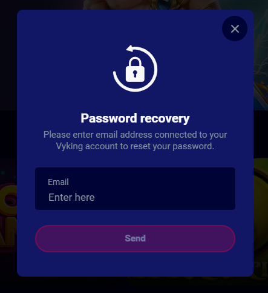

# 1. Login Feature


### Modal Creation
- **Purpose**: Develop a login modal that includes a backdrop shadow to enhance user focus on the authentication task.

### Input Fields
- **Specifications**: Implement the input fields as specified in the provided design mockup, which includes:
    - **Password Field Validation**:
        - **Minimum Length**: 4 characters.
        - **Maximum Length**: 16 characters.
        - An eye icon should be incorporated to toggle the visibility of the password.
    - **Forgot Password**: A 'Forgot Password' call-to-action (CTA) should lead to the Password Recovery modal.
    - **Button**: The button must be disabled if mandatory fields are empty or contain errors.

### Password Security
- **Encryption**: Passwords must be encrypted using MD5 before submission.

### Submission Logic and Error Handling
- **Functionality**: Develop logic for form submission that captures and handles errors efficiently, providing appropriate feedback to users.

## WebSocket Events for Login

### WebSocket Request Event
```json
{
    "event": "/ce/player/login",
    "payload": {
        "cUsername": "required - Username (UTF-8, up to 64 characters)",
        "cPassword": "required - Password (MD5, 32 characters); example MD5: 098f6bcd4621d373cade4e832627b4f6"
    }
}
```

### WebSocket Response - Error Event
```json
{
  "event": "/se/player/login",
  "status": 1001,
  "payload": {
    "message": "username or password is wrong"
  }
}
```


# 2. Password Recovery Feature



### Modal Creation
- **Purpose**: Develop a password recovery modal that includes a backdrop shadow to enhance user focus on the authentication task.

### Input Field
- **Specifications**: Implement the input field as specified in the provided design mockup, which includes:
    - **Password Recovery Field Validation**:
        - **Email Regular Expression Check**: The email must be valid. If it is not, display an error message below the input field and disable the "Send" button.
        - 
### Submission Logic and Error Handling
- **Functionality**: Develop logic for form submission that captures and handles errors efficiently, providing appropriate feedback to users.

### WebSocket Request Event
```json
{
    "event": "/ce/player/pwdResetByEmailRequest",
    "payload": {
        "cEmail": "required - Email (UTF-8)",
        "cLink": "https://demo.vyking.com/"
    }
}
```
### WebSocket Response - Success status
```json
{
  "event": "/se/player/pwdResetByEmailRequest",
  "status": 200,
  "payload": []
}
```

### WebSocket Response - Error status
```json
{
  "event": "/se/player/pwdResetByEmailRequest",
  "status": 1017,
  "payload": {
    "message": "unknown username or email"
  }
}
```


# 3. Logout Functionality
- **Implementation**: For logged-in users, replace the "Login" button with the "Logout" button. Append the "cUsername" value, received from the login server event response, to the left of the "Logout" button.

### Logout Button
- **Creation**: Create a logout button that triggers the following WebSocket event:


### WebSocket Request Event
```json
{
    "event": "/ce/player/logout",
    "payload": []
}
```

# 4. Payout Feature


### Requirement:

Create a payout animated sliding component that displays the following information:
1. data.player (white text)
2. data.currency + data.deposit (amount - white text)
3. data.currency + data.withdraw (amount - green text)

### Additional requirement:
- Sort the payload data values of 'ts' to retrieve newer values first.
- Create a recursive loop to clone elements in order to prevent empty space when the sliding list ends.

### WebSocket Request Event
```json
{
    "event": "/ce/payment/withdraw/bigSub",
    "payload": []
}
```

### WebSocket Response Event
```json
{
  "event": "/se/payment/withdraw/bigSub",
  "status": 200,
  "payload": [
    {
      "ts": "2024-03-01T10:38:07Z",
      "withdraw": 50000,
      "deposit": 5000,
      "player": "****twasc**",
      "currency": "EUR"
    },
    {
      "ts": "2024-03-01T10:38:53Z",
      "withdraw": 5000,
      "deposit": 3000,
      "player": "****emov**",
      "currency": "EUR"
    },
    {
      "ts": "2024-03-01T11:16:30Z",
      "withdraw": 21000,
      "deposit": 5000,
      "player": "****twasc**",
      "currency": "EUR"
    },
    {
      "ts": "2024-03-01T11:29:37Z",
      "withdraw": 203000,
      "deposit": 5000,
      "player": "****twasc**",
      "currency": "EUR"
    },
    {
      "ts": "2024-03-01T12:09:29Z",
      "withdraw": 75000,
      "deposit": 5000,
      "player": "****twasc**",
      "currency": "EUR"
    },
    {
      "ts": "2024-03-01T12:11:55Z",
      "withdraw": 30000,
      "deposit": 30000,
      "player": "****_F**",
      "currency": "EUR"
    },
    {
      "ts": "2024-03-01T12:14:15Z",
      "withdraw": 7000,
      "deposit": 2000,
      "player": "****sTe**",
      "currency": "EUR"
    }
  ]
}
```


#### All assets and mockups are available inside the **/src/assets** directory.

You can use Node version 20.12.2 and Yarn for project setup.
This code already contains a working Websocket and specifies the structure.

